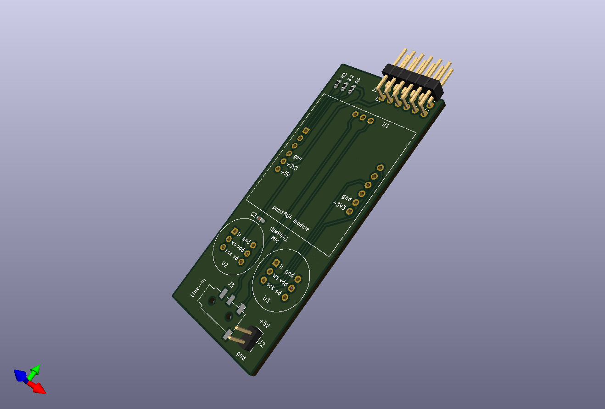
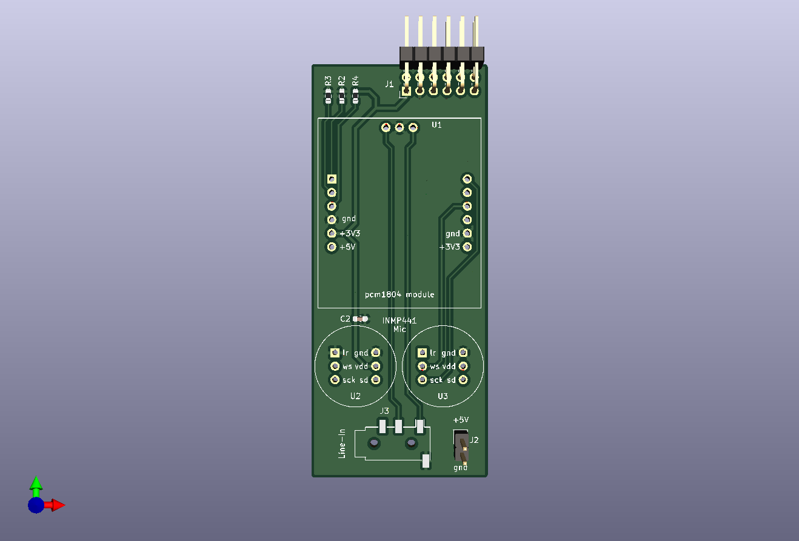
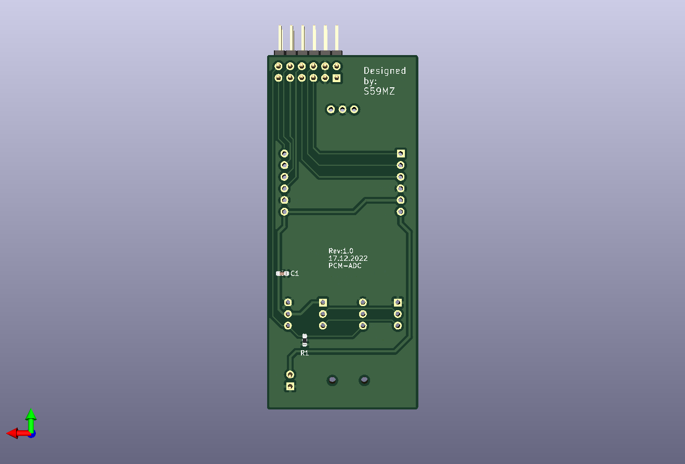

# pcm_adc_pmod
PCM1808 ADC Testing module with PMOD interface

Schematic:
[pcm_pmod.pdf](pcm_pmod.pdf)

BOM:
[pcm_pmod.csv](pcm_pmod.csv)

Gerbers:
[gerbers.zip](https://github.com/s59mz/kicad-pcm_adc/raw/main/gerbers.zip)
